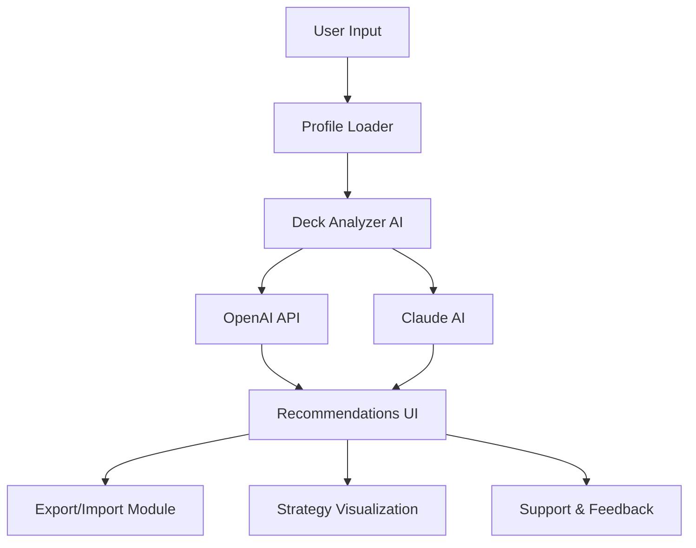

# SupremeSaiyan-Analyzer  
**Saiyan Strength Meets Strategic Intelligence: An AI-Powered Companion for Deck Builders**  
Bringing Dragon Ball Z’s strategic energy and AI-powered insight to the world of deck-building roguelikes.

---

---

## ⚡ Introduction

**SupremeSaiyan-Analyzer** is an advanced mod and companion app designed to supercharge your experience in deck-building roguelikes, such as _Slay the Spire 2_ and similar modern classics. Drawing inspiration from the legendary tenacity of DBZ’s Saiyans, this toolkit acts as your virtual Ki, optimizing deck compositions, battle strategies, and in-game decisions using the combined capabilities of OpenAI and Claude APIs.  
With a modern responsive UI, multilingual versatility, and round-the-clock smart assistant support, SupremeSaiyan-Analyzer is more than a tool—it’s your digital Z-Team, guiding you beyond the next boss fight!

---

## 🚀 Download & Quick Start

Get your journey underway by downloading the SupremeSaiyan-Analyzer package:

---

## 🌍 Multiplatform OS Compatibility

SupremeSaiyan-Analyzer is designed for global access and community play, offering seamless compatibility with top operating systems:

| OS           | Windows | Linux | macOS | Steam Deck |
|:------------:|:-------:|:-----:|:-----:|:----------:|
| **Support**  |   ✔️    |  ✔️   |  ✔️   |     ✔️     |

---

## 🔥 Key Features

- **Deck Analyzer AI:** Evaluate your deck’s power level and synergies with SupremeSaiyan intuition.
- **Responsive UI:** Sleek and reactive interface, scaling brilliantly across all devices and window sizes.
- **Multilingual Support:** Access in English, Japanese, Spanish, German, and French—every fighter is welcome.
- **AI-Powered Recommendations:** Integrates OpenAI + Claude for in-depth card, relic, and path advice.
- **Strategy Simulations:** Run hypothetical encounters and visualize probable outcomes.
- **Import/Export Profiles:** Move deck plans and configs smoothly between devices and friends.
- **Automated Battle Suggestions:** Smart, context-driven play suggestions to elevate win rates.
- **24/7 Customer Support:** Connect anytime; a digital Bulma is always on hand to help.
- **Theme Customization:** Switch between Capsule Corp blue, classic DBZ orange, and more!
- **Community Analytics:** See the most successful builds and global win/loss data.

---

## 🤖 AI Integrations

- **OpenAI**: Next-generation GPT models reflect on your deck, battle state, and optimal upgrades.
- **Claude AI**: Runs parallel strategic simulations for alternative paths, maximizing victory options.

---

## 💡 SEO-Friendly Use Cases

- _Optimize Slay the Spire decks with AI-powered strategy tools_
- _Build winning cards combinations using DBZ-inspired analytics_
- _Universal deckbuilding companion with multilingual support_
- _Export and share deck profiles for global tournaments_
- _Responsive, real-time deck synergies analyzer for hardcore players_

---

## 🛠️ How It Works (Architecture)

Mermaid diagram of the project’s flow:

---

## 📝 Example Profile Configuration

Want SupremeSaiyan-Analyzer to fit your playstyle? Here’s a taste of a YAML configuration:

    player:
      name: 'GokuUltra'
      game: 'SlayTheSpire2'
      prefer_attack: true
      ai_assist_level: 3
      languages:
        - 'en'
        - 'jp'
    deck_constraints:
      relic_blacklist:
        - 'Cursed Bell'
      auto_simulation: true
      ui_theme: 'CapsuleBlue'

---

## 🕹️ Example Console Invocation

Run the analyzer with your custom profile and game log:

    $ supremesaiyan-analyzer --profile config.yaml --log stsp2-run.json --output recommendations.html --lang en

---

## 🌟 Feature List

- Modern, cross-platform desktop app (Electron-based core)
- Deep, personalized AI insights for deck building and card choices
- Full customization via YAML or in-app UI
- In-game overlay via companion mode
- Automated session reports and play review
- Hands-on, real-time recommendation engine using familiar Dragon Ball Z metaphors
- Multilingual support for accessibility and inclusion
- Continuous support—questions never go unanswered, even at 3 A.M.!

---

## ⚠️ Disclaimer

SupremeSaiyan-Analyzer is a player companion tool designed for learning, community, and entertainment. It doesn’t alter the core game code nor interface with proprietary servers. SupremeSaiyan-Analyzer is a fan project, unaffiliated with the creators of Slay the Spire 2 or Dragon Ball Z. Use responsibly and enjoy the intersection of tactical depth and Saiyan inspiration!

---

## 📜 License

This project is open-sourced under the MIT License.  
See [MIT License](https://opensource.org/licenses/MIT) for details.

---

## 💾 Download (Again, for Global Warriors!)

---

2026 SupremeSaiyan-Analyzer — A new dimension in deck-building mastery!